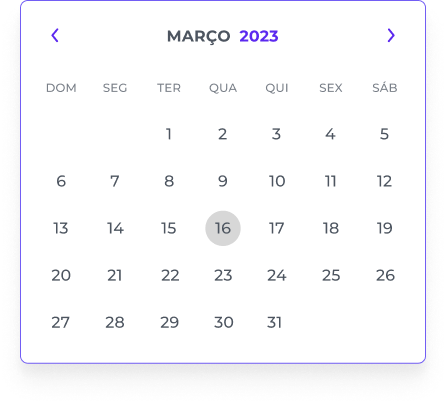

<div align="center">
  
  <p> Desafio Front-end - Housi</p>
</div>

**Objetivo:** Criar um componente de calendário que permita visualizar os dias do mês correspondente. Esse componente deve ser genérico, reutilizável e não deve ter estilização pré-definida.

## Tarefa Principal:

- Deve ser possível navegar para o próximo mês ou para o mês anterior.
- Deve ser possível receber uma lista de dias que contém um status e, com base nesse status, aplicar alguma regra de renderização diferente para um dia correspondente.

Para essa propriedade especial, deve receber o seguinte tipo de dado:

```tsx
const customDates = [
    {
       type: "block",
       date: "2024-01-01" // Pode ser do tipo Date também, se preferir
    },
    {
       type: "booked",
       date: "2024-01-02" // Pode ser do tipo Date também, se preferir
    },
    ...
]
```

Com essas datas, deve ser possível, por exemplo, realizar algum tipo de ação ou manipulação da data correspondente.

**Exemplo de protótipo:**



> **NOTA**: Esse calendário é apenas um exemplo, não é necessário criar algo parecido com a imagem.

## Bônus (Opcional)

- Criação de uma documentação detalhada sobre como utilizar o componente.
- Desenvolvimento de testes unitários para garantir a funcionalidade e a qualidade do código.

## OBS

- Obrigatório uso de React e TypeScript.
- Não está liberada a utilização de nenhum tipo de biblioteca além das mencionadas.
